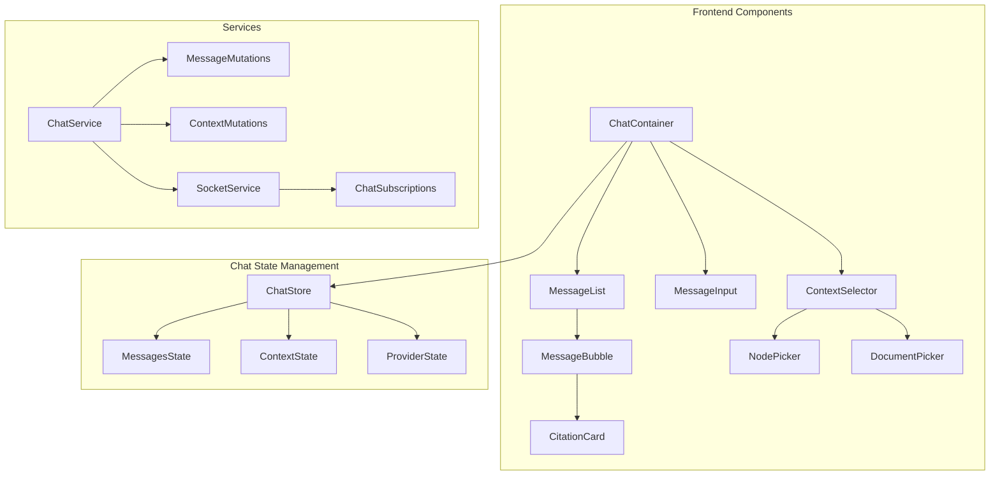
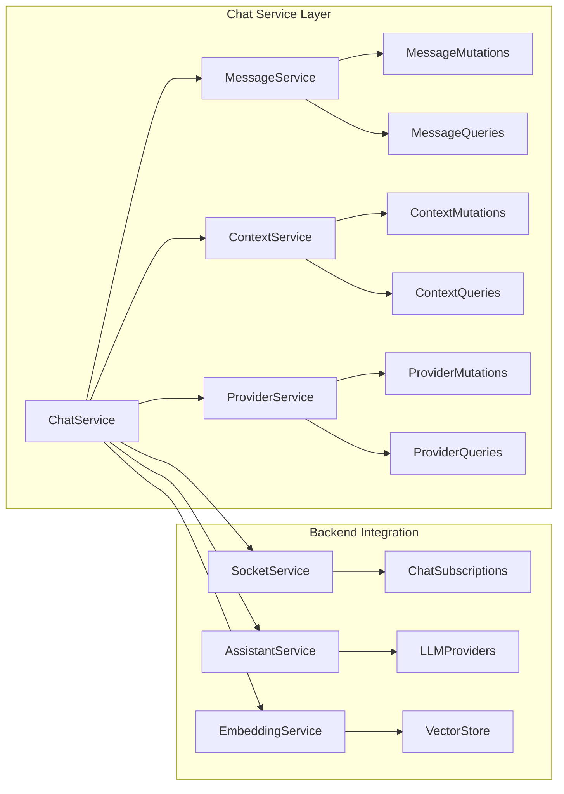
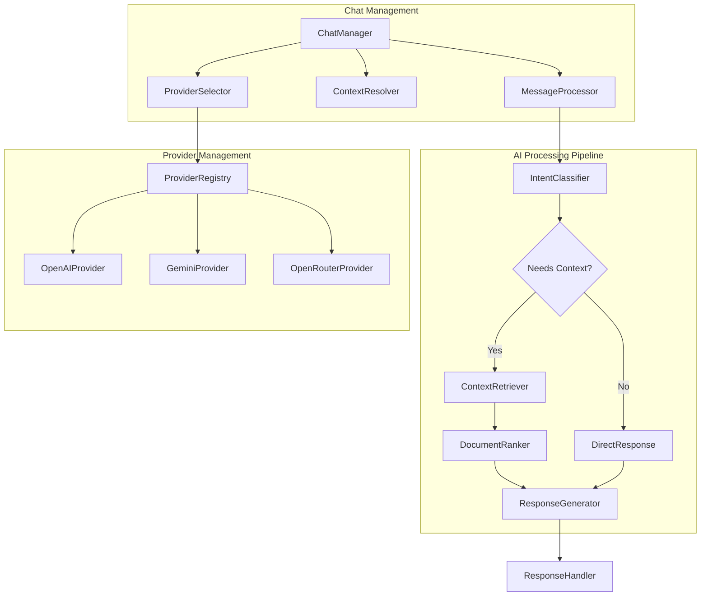
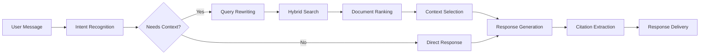

# AI Chat Integration Design

## Overview

This design document outlines the integration of AI chat features into the Colanode collaboration platform. The AI chat system will provide contextual assistance by leveraging the workspace's knowledge base, including documents, nodes, and database records. The integration extends the existing AI infrastructure to support multiple LLM providers including OpenRouter and Google Gemini, while maintaining the local-first architecture.

## Technology Stack & Dependencies

### Current AI Infrastructure
- **LangChain Framework**: Core AI orchestration with @langchain/core, @langchain/openai, @langchain/google-genai, @langchain/langgraph
- **Vector Database**: PostgreSQL with pgvector for semantic search
- **Embeddings**: OpenAI text-embedding-3-large (configurable)
- **Existing Providers**: OpenAI, Google Generative AI
- **Retrieval**: Hybrid search combining semantic and keyword search
- **Job Processing**: Background jobs via BullMQ and Redis

### New Dependencies
- **OpenRouter Integration**: HTTP client integration for OpenRouter API
- **Enhanced Provider Management**: Extended configuration for multiple LLM providers
- **Real-time Chat**: WebSocket-based chat interface using existing socket infrastructure

## Component Architecture

### Chat Interface Components



### Component Hierarchy

#### ChatContainer
- **Props**: `workspaceId`, `channelId?`, `contextNodes?`
- **State**: Chat messages, selected context, active provider
- **Responsibilities**: Orchestrates chat interface, manages context selection

#### MessageList
- **Props**: `messages`, `loading`, `onRetry`
- **State**: Scroll position, message visibility
- **Responsibilities**: Renders message history with citations

#### MessageInput
- **Props**: `onSend`, `disabled`, `placeholder`
- **State**: Input value, attachment state
- **Responsibilities**: Handles message composition and sending

#### ContextSelector
- **Props**: `workspace`, `onContextChange`
- **State**: Selected nodes, search query
- **Responsibilities**: Allows users to select specific context for AI queries

### Chat Service Architecture



## API Endpoints Reference

### Chat Management Endpoints

#### POST /v1/workspaces/{workspaceId}/chats
Create a new chat session
```typescript
interface CreateChatRequest {
  name?: string;
  contextNodeIds?: string[];
  providerConfig?: {
    provider: string;
    model: string;
    temperature?: number;
  };
}

interface CreateChatResponse {
  id: string;
  name: string;
  workspaceId: string;
  createdAt: string;
  contextNodeIds: string[];
}
```

#### GET /v1/workspaces/{workspaceId}/chats
List chat sessions
```typescript
interface ListChatsResponse {
  chats: Array<{
    id: string;
    name: string;
    lastMessageAt?: string;
    messageCount: number;
  }>;
}
```

#### POST /v1/chats/{chatId}/messages
Send a message to chat
```typescript
interface SendMessageRequest {
  content: string;
  contextNodeIds?: string[];
  providerOverride?: {
    provider: string;
    model: string;
  };
}

interface SendMessageResponse {
  messageId: string;
  timestamp: string;
}
```

### Provider Configuration Endpoints

#### GET /v1/ai/providers
List available AI providers
```typescript
interface ProvidersResponse {
  providers: Array<{
    id: string;
    name: string;
    enabled: boolean;
    models: string[];
    capabilities: string[];
  }>;
}
```

#### PUT /v1/ai/providers/{providerId}/config
Update provider configuration
```typescript
interface UpdateProviderRequest {
  enabled: boolean;
  apiKey?: string;
  baseUrl?: string;
  defaultModel?: string;
}
```

### Authentication Requirements
- All endpoints require valid workspace membership
- Provider configuration endpoints require admin permissions
- Chat creation requires write permissions in workspace

## Data Models & Schema

### Chat Schema
```typescript
interface Chat {
  id: string;
  workspaceId: string;
  name: string;
  createdBy: string;
  createdAt: Date;
  updatedAt: Date;
  contextNodeIds: string[];
  providerConfig: ProviderConfig;
}

interface ChatMessage {
  id: string;
  chatId: string;
  parentId?: string;
  type: 'user' | 'assistant';
  content: string;
  contextNodeIds?: string[];
  citations?: Citation[];
  providerUsed?: string;
  modelUsed?: string;
  createdAt: Date;
  createdBy: string;
}

interface Citation {
  sourceId: string;
  sourceType: 'document' | 'node' | 'record';
  quote: string;
  relevanceScore: number;
}
```

### Provider Configuration Schema
```typescript
interface ProviderConfig {
  provider: 'openai' | 'google' | 'openrouter';
  model: string;
  temperature?: number;
  maxTokens?: number;
  topP?: number;
}

interface OpenRouterConfig extends ProviderConfig {
  provider: 'openrouter';
  httpReferer?: string;
  xTitle?: string;
}

interface AIProviderSettings {
  id: string;
  name: string;
  enabled: boolean;
  apiKey: string;
  baseUrl?: string;
  defaultModel: string;
  availableModels: string[];
  capabilities: AICapability[];
}

type AICapability = 'chat' | 'embedding' | 'function_calling' | 'vision';
```

## Business Logic Layer

### Chat Management Architecture



#### ChatManager
**Responsibilities:**
- Manage chat lifecycle (create, update, delete)
- Handle message routing and processing
- Coordinate between context resolution and AI processing

**Key Methods:**
```typescript
class ChatManager {
  async createChat(workspaceId: string, config: CreateChatConfig): Promise<Chat>
  async sendMessage(chatId: string, message: string, context?: string[]): Promise<ChatMessage>
  async updateContext(chatId: string, contextNodeIds: string[]): Promise<void>
  async getHistory(chatId: string, limit?: number): Promise<ChatMessage[]>
}
```

#### ContextResolver
**Responsibilities:**
- Resolve context node IDs to actual content
- Expand context with descendant nodes
- Filter context based on permissions

**Key Methods:**
```typescript
class ContextResolver {
  async resolveContext(nodeIds: string[], userId: string): Promise<ContextItem[]>
  async expandContext(nodeIds: string[]): Promise<string[]>
  async filterByPermissions(context: ContextItem[], userId: string): Promise<ContextItem[]>
}
```

#### ProviderSelector
**Responsibilities:**
- Select appropriate AI provider based on task
- Handle provider failover and rate limiting
- Manage provider-specific configurations

**Key Methods:**
```typescript
class ProviderSelector {
  async selectProvider(task: AITask, workspace: string): Promise<AIProvider>
  async getAvailableModels(provider: string): Promise<string[]>
  async validateProviderConfig(config: ProviderConfig): Promise<boolean>
}
```

### Enhanced LLM Provider System

#### OpenRouter Integration
```typescript
class OpenRouterProvider implements AIProvider {
  private baseUrl = 'https://openrouter.ai/api/v1';
  
  async chat(messages: ChatMessage[], config: OpenRouterConfig): Promise<ChatResponse> {
    const response = await fetch(`${this.baseUrl}/chat/completions`, {
      method: 'POST',
      headers: {
        'Authorization': `Bearer ${config.apiKey}`,
        'HTTP-Referer': config.httpReferer || 'https://colanode.com',
        'X-Title': config.xTitle || 'Colanode',
        'Content-Type': 'application/json'
      },
      body: JSON.stringify({
        model: config.model,
        messages,
        temperature: config.temperature,
        max_tokens: config.maxTokens
      })
    });
    
    return this.parseResponse(response);
  }
  
  async getAvailableModels(): Promise<OpenRouterModel[]> {
    // Fetch from OpenRouter models endpoint
  }
}
```

#### Enhanced Google Gemini Integration
```typescript
class EnhancedGeminiProvider implements AIProvider {
  async chat(messages: ChatMessage[], config: GeminiConfig): Promise<ChatResponse> {
    const model = new ChatGoogleGenerativeAI({
      model: config.model,
      temperature: config.temperature,
      apiKey: config.apiKey,
      safetySettings: config.safetySettings
    });
    
    return await model.invoke(messages);
  }
  
  async embedText(text: string): Promise<number[]> {
    // Gemini embedding implementation
  }
}
```

### Context Integration Pipeline



#### Context Retrieval Enhancement
```typescript
interface ContextRetrieval {
  async retrieveRelevantContext(
    query: string,
    workspaceId: string,
    contextNodeIds?: string[],
    maxResults?: number
  ): Promise<ContextDocument[]>
  
  async rerankDocuments(
    documents: ContextDocument[],
    query: string
  ): Promise<RankedDocument[]>
  
  async extractCitations(
    response: string,
    sourceDocuments: ContextDocument[]
  ): Promise<Citation[]>
}
```

## Middleware & WebSocket Integration

### Chat Event Handling
```typescript
interface ChatEvents {
  'chat.message.sent': {
    chatId: string;
    messageId: string;
    content: string;
  };
  
  'chat.response.streaming': {
    chatId: string;
    messageId: string;
    chunk: string;
    done: boolean;
  };
  
  'chat.context.updated': {
    chatId: string;
    contextNodeIds: string[];
  };
  
  'chat.provider.changed': {
    chatId: string;
    provider: string;
    model: string;
  };
}
```

### WebSocket Message Handlers
```typescript
class ChatSocketHandler {
  async handleChatMessage(connection: SocketConnection, message: ChatMessage) {
    // Validate permissions
    // Process message through AI pipeline
    // Stream response chunks
    // Update chat history
  }
  
  async handleContextUpdate(connection: SocketConnection, update: ContextUpdate) {
    // Validate context permissions
    // Update chat context
    // Broadcast to chat participants
  }
}
```

## State Management Architecture

### Chat Store Structure
```typescript
interface ChatState {
  activeChats: Map<string, Chat>;
  messages: Map<string, ChatMessage[]>;
  streamingResponses: Map<string, string>;
  contextSelections: Map<string, string[]>;
  providerConfigs: Map<string, ProviderConfig>;
  loading: {
    sendingMessage: boolean;
    loadingHistory: boolean;
    updatingContext: boolean;
  };
}

interface ChatActions {
  sendMessage(chatId: string, content: string): Promise<void>;
  updateContext(chatId: string, nodeIds: string[]): Promise<void>;
  changeProvider(chatId: string, config: ProviderConfig): Promise<void>;
  loadHistory(chatId: string, before?: string): Promise<void>;
  createChat(workspaceId: string, config?: CreateChatConfig): Promise<string>;
}
```

### Real-time Updates
```typescript
class ChatSubscriptionManager {
  subscribe(chatId: string, callbacks: ChatCallbacks): string {
    // Subscribe to chat events via WebSocket
    // Handle streaming responses
    // Update local state
  }
  
  unsubscribe(subscriptionId: string): void {
    // Clean up subscriptions
  }
  
  handleStreamingResponse(chatId: string, chunk: ResponseChunk): void {
    // Append to streaming response
    // Update UI incrementally
  }
}
```

## Testing Strategy

### Unit Testing
```typescript
// Provider Testing
describe('OpenRouterProvider', () => {
  test('should format messages correctly', async () => {
    const provider = new OpenRouterProvider(mockConfig);
    const result = await provider.chat(mockMessages, mockConfig);
    expect(result.content).toBeDefined();
  });
  
  test('should handle rate limiting gracefully', async () => {
    // Mock rate limit response
    // Verify retry logic
  });
});

// Context Retrieval Testing
describe('ContextResolver', () => {
  test('should resolve context with proper permissions', async () => {
    const resolver = new ContextResolver(mockDatabase);
    const context = await resolver.resolveContext(nodeIds, userId);
    expect(context).toHaveLength(expectedLength);
  });
});
```

### Integration Testing
```typescript
// Chat Flow Testing
describe('Chat Integration', () => {
  test('should complete full chat flow with context', async () => {
    // Create chat
    // Send message with context
    // Verify AI response
    // Check citations
  });
  
  test('should handle provider failover', async () => {
    // Mock primary provider failure
    // Verify fallback to secondary provider
  });
});
```

### WebSocket Testing
```typescript
describe('Chat WebSocket', () => {
  test('should stream response chunks in order', async () => {
    // Send message via WebSocket
    // Collect streaming chunks
    // Verify complete response assembly
  });
});
```