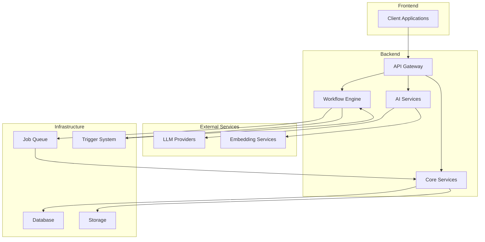
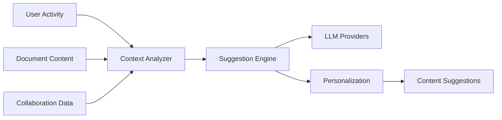
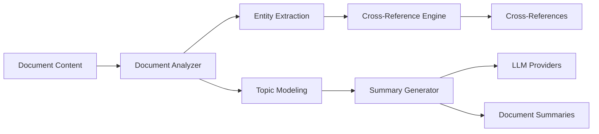
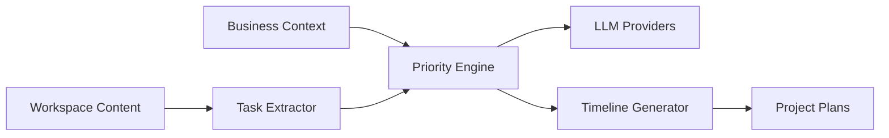
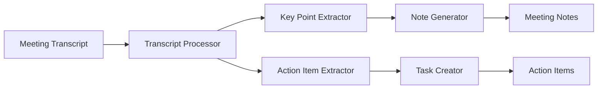
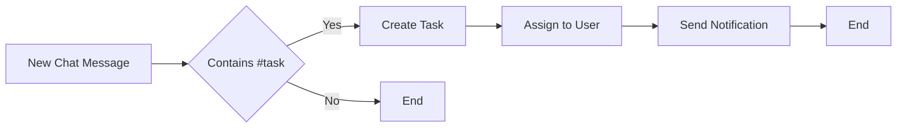
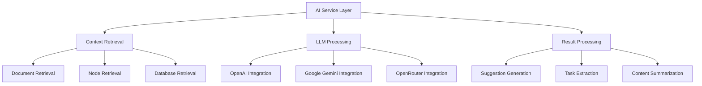
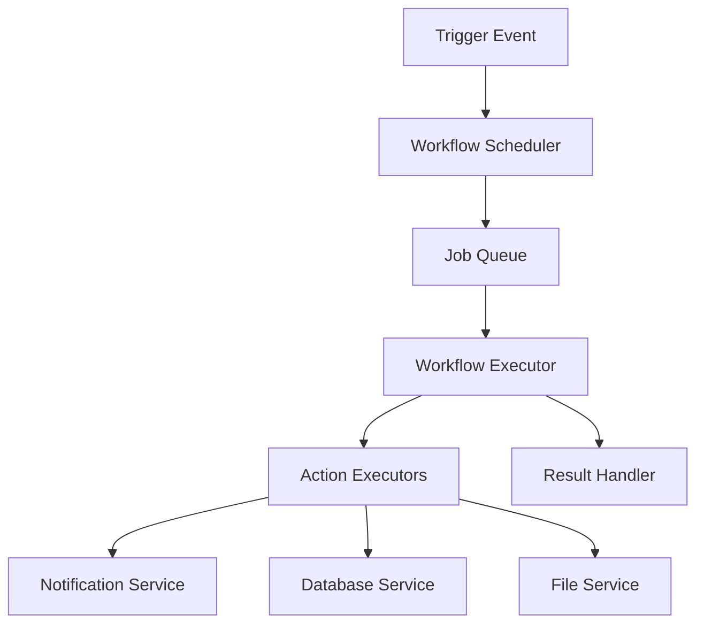

# AI Integration Suite & Workflow Automation Design

## 1. Overview

This document outlines the design for enhancing the AI capabilities of Colanode and implementing a comprehensive workflow automation system. The enhancements include AI-powered content suggestions, intelligent document processing, AI-driven project management, and smart meeting notes, along with a built-in workflow automation engine similar to Zapier.

## 2. Architecture

The enhanced system follows a modular architecture that extends the existing Colanode infrastructure:



### 2.1 Key Components

1. **AI Services Layer**: Extends existing AI capabilities with new features
2. **Workflow Engine**: New module for creating and executing automated workflows
3. **Trigger System**: Event-based system for initiating workflows
4. **Job Queue**: Enhanced job processing for workflow execution

## 3. Error Handling and Fallback Strategies

### 3.1 Graceful Degradation Modes

Each AI feature implements multiple fallback modes to ensure continued functionality even when primary AI services are unavailable:

1. **Content Suggestions**:
   - Primary: LLM-based contextual suggestions
   - Fallback 1: Rule-based suggestions using keyword matching
   - Fallback 2: Collaborative filtering based on similar users
   - Offline Mode: Recently accessed content suggestions

2. **Document Summarization**:
   - Primary: LLM-based intelligent summarization
   - Fallback 1: Extractive summarization using sentence scoring
   - Fallback 2: First and last paragraph extraction
   - Offline Mode: Pre-computed document outlines

3. **Task Prioritization**:
   - Primary: AI-driven priority scoring
   - Fallback 1: Rule-based prioritization (due dates, assignees)
   - Fallback 2: Simple chronological ordering
   - Offline Mode: Manual priority settings

4. **Meeting Notes**:
   - Primary: LLM-powered action item extraction
   - Fallback 1: Keyword-based item detection
   - Fallback 2: Speaker turn segmentation
   - Offline Mode: Manual note creation

### 3.2 Fallback to Simpler Heuristics

When LLMs fail or return poor results, the system automatically switches to heuristic-based approaches:

- **Keyword-based Analysis**: Use TF-IDF and keyword extraction for basic content understanding
- **Pattern Matching**: Apply regex patterns for structured data extraction
- **Statistical Methods**: Use frequency analysis for content categorization
- **Collaborative Filtering**: Leverage similar user behavior for recommendations

### 3.3 User-Configurable AI Confidence Thresholds

Users can configure confidence thresholds for different AI features:

- **Low Threshold (0.3)**: Show all suggestions, even potentially irrelevant ones
- **Medium Threshold (0.6)**: Show only moderately confident suggestions
- **High Threshold (0.8)**: Show only highly confident suggestions

These thresholds are adjustable per feature and per user, with organization-wide defaults.

## 4. Cost Management

### 4.1 Usage Monitoring and Budgeting Controls

Implement comprehensive cost tracking and budgeting:

1. **Real-time Cost Tracking**:
   - Track API usage per provider (OpenAI, Google, OpenRouter)
   - Monitor usage by feature and user
   - Set up alerts for approaching budget limits

2. **Budget Allocation**:
   - Organization-level budgets
   - Team/department sub-budgets
   - Individual user quotas

3. **Cost Analytics Dashboard**:
   - Daily/weekly/monthly spending trends
   - Feature usage breakdown
   - Cost per user/team analysis

### 4.2 Smart Caching Strategy

Implement multi-level caching to minimize redundant AI requests:

1. **Result Caching**:
   - Cache AI-generated summaries for 24 hours
   - Cache content suggestions for 6 hours
   - Cache task extractions for 12 hours

2. **Context Caching**:
   - Cache document embeddings for 7 days
   - Cache user preference profiles
   - Cache workspace context models

3. **Invalidation Strategy**:
   - Automatic cache invalidation on content changes
   - Manual cache clearing options
   - Time-based expiration policies

### 4.3 User Settings for AI Feature Frequency

Provide granular controls for AI feature usage:

- **Real-time Processing**: Process content immediately as it's created
- **Batch Processing**: Process content at scheduled intervals
- **Manual Trigger**: Only process content when explicitly requested
- **Disabled**: Completely disable specific AI features

### 4.4 Cost Management Dashboard

A centralized dashboard for monitoring and controlling AI costs:

- Real-time spending visualization
- Budget vs. actual spending comparison
- Feature usage heatmaps
- Cost optimization recommendations
- Usage alerts and notifications

## 5. Privacy and Consent Controls

### 5.1 Explicit User Controls

Provide granular privacy controls for AI processing:

1. **Opt-out Mechanisms**:
   - Per-document opt-out of AI analysis
   - Per-workspace AI processing controls
   - Per-feature enable/disable toggles

2. **Sensitive Content Detection**:
   - Automatic detection of potentially sensitive content
   - User prompts for confirmation before processing
   - Content type classification (public/private/confidential)

### 5.2 Data Retention Policies

Implement clear data retention policies for AI-processed content:

- **Temporary Processing Data**: Retained for 30 days then deleted
- **Cached Results**: Retained for 90 days with automatic cleanup
- **User Feedback Data**: Retained indefinitely for model improvement
- **Usage Analytics**: Retained for 2 years for billing/optimization

### 5.3 Clear AI Activity Indicators

Provide transparent indicators when AI is analyzing content:

- Visual badges on documents being processed
- Status indicators in the UI
- Activity logs showing AI processing events
- User notifications for significant AI actions

## 7. Enhanced AI Integration Features

### 7.1 AI-Powered Content Suggestions

#### Feature Description
Provide contextual content suggestions based on workspace activity, user behavior, and collaborative patterns.

#### Implementation
- **Context Analysis Service**: Analyze user interactions, document content, and collaboration patterns
- **Suggestion Engine**: Generate relevant content suggestions using LLMs
- **Personalization Layer**: Customize suggestions based on user preferences and behavior

#### Data Flow


### 7.2 Intelligent Document Summarization and Cross-Referencing

#### Feature Description
Automatically generate document summaries and identify cross-references between related content.

#### Implementation
- **Document Analysis Service**: Process documents for key topics and entities
- **Cross-Reference Engine**: Identify relationships between documents
- **Summary Generator**: Create concise summaries using LLMs

#### Data Flow


### 7.3 AI-Driven Project Management and Task Prioritization

#### Feature Description
Automatically organize tasks, set priorities, and suggest project timelines based on content analysis.

#### Implementation
- **Task Analysis Service**: Extract tasks from documents and conversations
- **Priority Engine**: Determine task priorities using business context
- **Timeline Generator**: Create project timelines and milestones

#### Data Flow


### 7.4 Smart Meeting Notes with Action Item Extraction

#### Feature Description
Automatically generate meeting notes and extract actionable items from meeting transcripts.

#### Implementation
- **Transcript Processor**: Process meeting transcripts for key information
- **Action Item Extractor**: Identify and categorize action items
- **Note Generator**: Create structured meeting notes

#### Data Flow


## 8. Workflow Automation System

### 8.1 Custom Workflow Builder

#### Feature Description
A visual workflow builder that allows users to create custom automation workflows without coding.

#### Implementation
- **Visual Editor**: Drag-and-drop interface for building workflows
- **Trigger System**: Event-based triggers for workflow initiation
- **Action Executor**: Execute actions based on workflow definitions

#### Components
1. **Trigger Nodes**: Define when workflows should start
2. **Condition Nodes**: Add logic and branching to workflows
3. **Action Nodes**: Define what should happen in the workflow
4. **Connector System**: Link nodes together to form workflows

#### Workflow Example


### 8.2 Automated Database Record Creation from Chat Messages

#### Feature Description
Automatically create database records from structured information in chat messages.

#### Implementation
- **Message Parser**: Identify structured data in chat messages
- **Record Creator**: Create database records from parsed data
- **Validation Engine**: Ensure data quality and consistency

### 8.3 Smart Notifications Based on Content Analysis

#### Feature Description
Send targeted notifications based on the semantic content of workspace activities.

#### Implementation
- **Content Analyzer**: Analyze workspace content for notification triggers
- **Notification Engine**: Generate and send relevant notifications
- **Delivery System**: Handle notification delivery across channels

### 8.4 Auto-Categorization of Files and Documents

#### Feature Description
Automatically categorize and tag files based on their content and context.

#### Implementation
- **Content Classifier**: Analyze file content for categorization
- **Tagging Engine**: Generate relevant tags and categories
- **Organization System**: Apply categorization to the file system

## 9. Advanced Collaboration Features

### 9.1 AI-Moderated Discussions with Conflict Resolution

#### Feature Description
Use AI to moderate discussions and suggest conflict resolution approaches.

#### Implementation
- **Sentiment Analyzer**: Detect emotional tone in discussions
- **Conflict Detector**: Identify potential conflicts
- **Resolution Suggester**: Propose conflict resolution strategies

### 9.2 Intelligent Workspace Organization Recommendations

#### Feature Description
Provide AI-powered recommendations for organizing workspace content.

#### Implementation
- **Organization Analyzer**: Analyze current workspace structure
- **Recommendation Engine**: Generate organization suggestions
- **Implementation Helper**: Assist with applying recommendations

### 9.3 Auto-Generated Progress Reports

#### Feature Description
Automatically generate progress reports from workspace activity.

#### Implementation
- **Activity Tracker**: Monitor workspace activity and progress
- **Report Generator**: Create structured progress reports
- **Visualization Engine**: Generate charts and graphs for reports

### 9.4 Smart Context Switching

#### Feature Description
Intelligently switch context between related documents and tasks.

#### Implementation
- **Context Mapper**: Map relationships between workspace items
- **Switching Engine**: Enable seamless context transitions
- **History Tracker**: Maintain context switching history

## 10. API Endpoints

### 10.1 AI Services Endpoints

| Endpoint | Method | Description |
|----------|--------|-------------|
| `/api/ai/suggestions` | POST | Generate content suggestions |
| `/api/ai/summarize` | POST | Summarize document content |
| `/api/ai/tasks` | POST | Extract tasks from content |
| `/api/ai/meeting-notes` | POST | Generate meeting notes |

### 10.2 Workflow Automation Endpoints

| Endpoint | Method | Description |
|----------|--------|-------------|
| `/api/workflows` | GET/POST | List/create workflows |
| `/api/workflows/{id}` | GET/PUT/DELETE | Get/update/delete workflow |
| `/api/workflows/{id}/execute` | POST | Manually execute workflow |
| `/api/workflows/triggers` | GET | List available triggers |

## 11. Data Models

### 11.1 Workflow Model

```typescript
interface Workflow {
  id: string;
  name: string;
  description: string;
  enabled: boolean;
  trigger: Trigger;
  conditions: Condition[];
  actions: Action[];
  createdAt: Date;
  updatedAt: Date;
}

interface Trigger {
  type: 'chat_message' | 'file_upload' | 'database_change' | 'schedule';
  config: Record<string, any>;
}

interface Condition {
  type: 'content_match' | 'user_role' | 'time_range';
  config: Record<string, any>;
}

interface Action {
  type: 'create_task' | 'send_notification' | 'update_database' | 'move_file';
  config: Record<string, any>;
}
```

### 11.2 AI Suggestion Model

```typescript
interface AISuggestion {
  id: string;
  type: 'content' | 'task' | 'organization';
  content: string;
  context: Record<string, any>;
  relevanceScore: number;
  createdAt: Date;
}
```

## 12. Business Logic Layer

### 12.1 AI Services Architecture

The AI services extend the existing LangChain-based implementation with additional capabilities:



### 12.2 Workflow Engine Architecture

The workflow engine uses a queue-based processing system:



## 13. Technical Improvements

### 13.1 Workflow Builder UX Enhancements

#### Drag-and-Drop Interface Components

The workflow builder features a modern, intuitive interface:

- **Node Palette**: Sidebar with categorized workflow components
- **Canvas Area**: Main workspace for building workflows
- **Property Panel**: Context-sensitive configuration for selected nodes
- **Connection Tools**: Visual tools for linking workflow nodes
- **Zoom Controls**: Pan and zoom capabilities for large workflows

#### Template Library

Pre-built workflow templates for common use cases:

- **Task Management**: Automatically create tasks from chat messages
- **Content Organization**: Categorize files based on content
- **Meeting Follow-up**: Generate action items from meeting notes
- **Data Sync**: Sync database records between systems
- **Notification Routing**: Route notifications based on content

#### Real-Time Testing/Preview

Interactive workflow testing capabilities:

- **Simulation Mode**: Test workflows without executing actions
- **Step-by-Step Execution**: Debug workflows node by node
- **Data Injection**: Provide test data for workflow inputs
- **Execution Visualization**: Visual feedback on workflow execution
- **Error Diagnostics**: Detailed error information for failed workflows

#### Version Control for Workflows

Built-in version management for workflows:

- **Version History**: Track all changes to workflow definitions
- **Diff Viewer**: Visual comparison between workflow versions
- **Rollback Capability**: Revert to previous workflow versions
- **Branching**: Create workflow variants for testing
- **Merge Conflicts**: Resolve conflicts when merging workflow changes

### 13.2 AI Suggestion Relevance Mechanisms

#### User Feedback on Suggestion Quality

Implement feedback loops to improve suggestion relevance:

- **Explicit Feedback**: Thumbs up/down ratings for suggestions
- **Implicit Feedback**: Track suggestion acceptance/rejection
- **Feedback Dashboard**: Analytics on suggestion performance
- **Quality Scoring**: Automated quality metrics for suggestions

#### Learning from User Patterns

Adaptive learning from user behavior:

- **Acceptance Tracking**: Monitor which suggestions users accept
- **Rejection Analysis**: Understand why suggestions are rejected
- **Personalization Models**: User-specific suggestion preferences
- **Team Patterns**: Group-level suggestion preferences

#### Contextual Filtering

Dynamic filtering based on current context:

- **Task-Based Filtering**: Prioritize suggestions related to current task
- **Project Context**: Filter suggestions by active project
- **Time Sensitivity**: Adjust suggestions based on deadlines
- **User Role**: Customize suggestions based on user permissions

### 13.3 Performance Safeguards

#### Maximum Processing Time Limits

Prevent AI operations from consuming excessive resources:

- **Timeout Configuration**: Per-feature timeout settings
- **Graceful Degradation**: Fallback when timeouts occur
- **Progress Monitoring**: Real-time tracking of AI operations
- **Cancellation Support**: Allow users to cancel long operations

#### Queue Prioritization

Intelligent job queue management:

- **Priority Levels**: Critical, High, Normal, Low priority jobs
- **Interactive Jobs**: Prioritize user-facing operations
- **Background Jobs**: Schedule non-critical operations
- **Resource Allocation**: Dynamic resource distribution

#### Resource Usage Monitoring

Comprehensive monitoring of system resources:

- **CPU/Memory Tracking**: Per-feature resource consumption
- **API Usage Limits**: Monitor external service usage
- **Performance Alerts**: Notifications for resource issues
- **Usage Analytics**: Historical resource consumption trends

## 14. Integration Points

### 14.1 With Existing AI System

The new features integrate with the existing AI infrastructure:

- Reuse existing LLM provider integrations (OpenAI, Google, OpenRouter)
- Extend the context retrieval system for enhanced suggestions
- Leverage existing embedding infrastructure for content analysis

### 14.2 With Core Services

Integration with core Colanode services:

- **Chat Service**: Process chat messages for task extraction
- **Document Service**: Analyze documents for summarization
- **Database Service**: Create records from structured content
- **File Service**: Categorize and tag uploaded files

## 14. Security Considerations

1. **Data Privacy**: Ensure AI processing respects user privacy settings
2. **Access Control**: Implement proper RBAC for workflow execution
3. **Audit Logging**: Log all AI suggestions and workflow executions
4. **Content Filtering**: Implement content filtering for AI-generated content

## 15. Performance Considerations

1. **Caching**: Cache AI results to reduce redundant processing
2. **Batching**: Batch similar AI requests for efficiency
3. **Asynchronous Processing**: Use job queues for time-intensive operations
4. **Rate Limiting**: Implement rate limiting for external AI services

## 16. Testing Strategy

### 16.1 Unit Testing

- Test individual AI service functions
- Test workflow trigger and action components
- Test integration with existing services

### 16.2 Integration Testing

- Test end-to-end AI suggestion generation
- Test workflow execution with various triggers
- Test integration with external LLM providers

### 16.3 Performance Testing

- Test AI processing latency
- Test workflow execution under load
- Test scalability of the job queue system